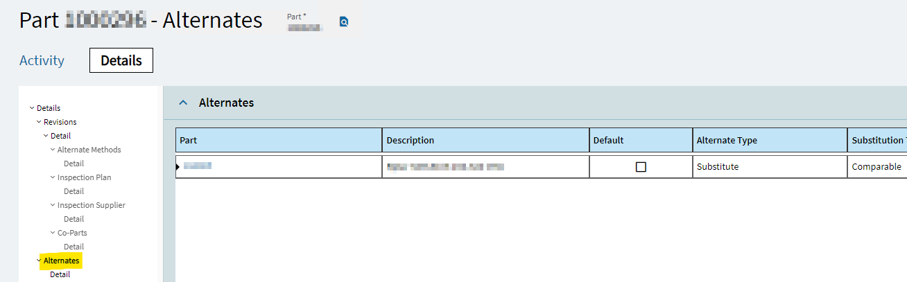

# AltPartNumDatalinkECM
Update Line Item PartNums in SO Automation to an Alternate PartNum if there is one available.

## Overview
Within Kinetic there are numerous types of Alternative Part Numbers.  This guide is referring to the PartSubs table found directly within Part Entry under the Alternates pane. These are Substitute Parts, not to be confused with Customer Part Cross Reference parts, or Supplier Part Cross Reference Parts. 



## Creating The Datalink

Add the following Datalink to your CallDefinitions.json file or add it using the JSON Web Service built directly into ECM.     

Update ENVIRONMENTURL to match your Environment.  

```
{
    "Name": "AlternatePart",
    "Url": "ENVIRONMENTURL/api/v1/Erp.BO.AlternatePartSvc/AlternateParts?%24filter=Company%20eq%20'@Company'%20and%20PartNum%20eq%20'@PartNum'%20and%20RecType%20eq%20'S'",
    "Method": "Get",
    "AuthScheme": "@TokenType",
    "AuthParameter": "@AccessToken",
    "AllowInvalidSSL": false,
    "CallChain": "ErpLogin",
    "LogPath": "C:\\temp\\AlternatePart.log",
    "WSHeaders": [
      {
        "Key": "CallSettings",
        "Value": "{Company: \"@Company\", PartNum: \"@PartNum\", RecType: \"@RecType\"}"
      }
    ],
    "CollectionPath": "value",
    "Columns": [
      {
        "Name": "Company",
        "Path": "Company"
      },
      {
        "Name": "PartNum",
        "Path": "PartNum"
      },
      {
        "Name": "RecType",
        "Path": "RecType"
      },
      {
        "Name": "SubPart",
        "Path": "SubPart"
      }
    ]
  }
```

This datalink uses the Rest Call, AlternatePartSvc, to find if the PartNum has a matching Substitute Part within Kinetic. 


## Creating Fields and Field Groups

Within the workflow we'll need to store the datalink's results in a fieldgroup.  We'll create the field group in ECM and call it **SUBPART**.

Add two fields to the fieldgroup called: 
- SUBPART_PartNum
- SUBPART_AltPartNum


## Adding an Additional Step to the Workflow


We'll an additional step to the Stock Workflow after **Check Line Items**.  Update the branching accordingly so that the steps flow properly.   


## Adding an Action to the new Step

Within our new step we will add a single **Action**. You can call it *Update Part Num*. We will add four tasks to that Action:
- Datalink Field Group
- Aggregrate
- End Action
- Advanced Math


## Adding the Tasks to the Action


